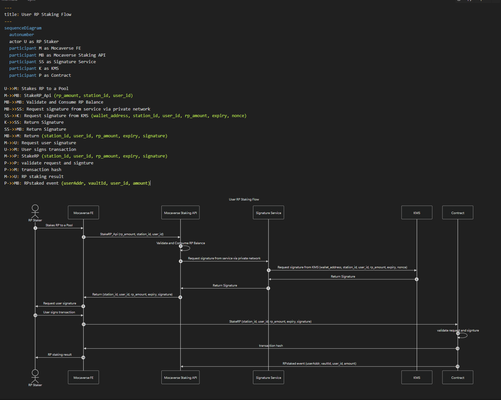

# Staking RealmPoints

- Contract has a stored signer
- User calls Contract `StakeRP` function with ECDSA signature provided by backend
    - Private key for ECDSA is generated and stored in AWS KMS - remain unseen by human
    - Contract verifies the `signature` within the `StakeRP` transaction
    - Contract stores used nonces to prevent replay

## High level flow

1. User interacts with the Mocaverse Frontend (FE) to stake RP into a pool.
2. Mocaverse FE sends a staking request to the Mocaverse Staking API.
3. Mocaverse Staking API validates the RP balance and consumes the staked amount.
4. Mocaverse Staking API sends a signature request to the Signature Service via a private network.
5. Signature Service requests a signature from AWS KMS.
6. AWS KMS generates and returns the signature to the Signature Service.
7. Signature Service sends the generated signature back to the Mocaverse Staking API.
8. Mocaverse Staking API returns the staking data and signature to the frontend.
9. Mocaverse FE prompts the user to sign the transaction.
10. User signs the transaction through the frontend.
11. Mocaverse FE calls the staking contract with the necessary staking data and signature.
12. Contract validates the signature and the staking request.
13. Contract generates a transaction hash and returns it to the frontend.
14. Mocaverse FE displays the staking result to the user.
15. Contract emits an event indicating successful RP staking.